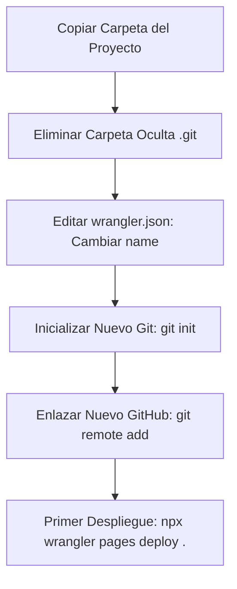

# 🤖 Instrucciones para Trabajar con la IA (Cerebro Externo)

Este archivo contiene el prompt de contextualización para "educar" a la IA al iniciar un nuevo proyecto o una nueva sesión de chat, y la guía paso a paso para duplicar tus proyectos de forma segura y sin colisiones en Git o Cloudflare (Wrangler).

---

## 1. 📋 Prompt para Copiar y Pegar al iniciar un nuevo chat
Cuando abras un nuevo chat con la IA para realizar cambios en este proyecto o al clonarlo para uno nuevo, copia y pega el siguiente texto en tu primer mensaje para cargar de inmediato todas nuestras reglas refinadas en su contexto:

```markdown
Hola. Vamos a trabajar en este proyecto web. En la raíz tienes el archivo README.md, el cual contiene las directivas de nuestro proyecto.
Quiero que leas y apliques estrictamente todas las directivas de la sección "Reglas de Oro de Diseño y Código" en cada línea de código que generes, en especial:
- Reglas 1-5: Optimización de imágenes (WebP), evitar width: 100vw, scrollbar-gutter y variables.
- Regla 7: Alturas dinámicas en modales y menús utilizando unidades 'dvh'.
- Regla 8: Colores con alto contraste de texto inicial nativo en móviles sin depender de :hover.
- Regla 11: Ejes de composición y balance de peso visual (centrado vertical en el Hero).
- Regla 12: Coreografía de carga secuencial mediante retardos (animation-delay staggered).
- Regla 14: Directiva de responsividad profesional (inputs de 16px para iOS, zonas táctiles de 44px).
- Reglas 15-16: Sincronización automática de CI/CD (Git, GitHub, Wrangler) y aislamiento de proyectos.
- Regla 17: Directiva de revisión de calidad exhaustiva preventiva y educación didáctica.

Mantén el estilo BEM, minimalista, limpio y de lujo editorial que hemos construido.
```

---

## 2. ⚡ Guía de Duplicación Segura para Nuevos Proyectos
Para crear un nuevo sitio web utilizando este proyecto como plantilla, sigue estos pasos obligatorios en orden para evitar que las actualizaciones de tu nuevo proyecto sobrescriban la web en producción de este repositorio:



### Paso 1: Duplicar la carpeta física
1. Copia la carpeta de este proyecto y pégala con el nombre de tu nuevo sitio (ej: `c:/webs/proyecto-nuevo`).

### Paso 2: Desvincular el repositorio Git anterior (CRÍTICO)
1. Ve a la carpeta de tu nuevo proyecto.
2. Asegúrate de tener activada la opción de ver archivos ocultos en tu explorador de archivos.
3. **Elimina la carpeta oculta `.git`**. Esto desconectará por completo tu nuevo sitio del repositorio de GitHub de Mikáera Studio.
4. Abre la consola en el nuevo directorio y ejecuta:
   ```bash
   git init
   git add .
   git commit -m "initial commit: clonación segura de plantilla raíz"
   git remote add origin <URL_DE_TU_NUEVO_REPOSITORIO_DE_GITHUB>
   git branch -M main
   git push -u origin main
   ```

### Paso 3: Evitar colisión de despliegue en Cloudflare (EL RIESGO MÁS GRANDE)
Si ejecutas Wrangler en la carpeta nueva sin cambiar la configuración, **sobrescribirás la web pública de Mikáera Studio**.
1. Abre el archivo `wrangler.json` en la raíz de tu nuevo proyecto.
2. Cambia el valor de `"name"` por el nombre de tu nuevo proyecto en Cloudflare (ej: `"name": "nuevo-proyecto-fotos"`):
   ```json
   {
     "$schema": "node_modules/wrangler/config-schema.json",
     "name": "nuevo-proyecto-fotos",
     "pages_build_output_dir": "."
   }
   ```
3. Ejecuta el primer despliegue. Cloudflare creará el proyecto en tu panel si no existe y subirá los archivos a la URL correspondiente del nuevo sitio:
   ```bash
   npx wrangler pages deploy .
   ```
