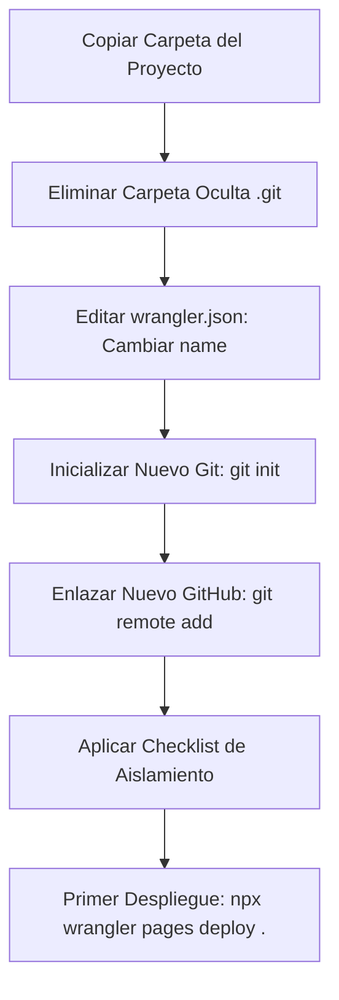

# 🚀 Guía de Creación de Nuevos Proyectos (Plantilla Base)

Este archivo es el manual completo y detallado para clonar, aislar y configurar un nuevo sitio web utilizando este proyecto como plantilla. Sigue estas instrucciones para desvincular por completo el nuevo sitio del original y evitar colisiones de bases de datos de temas, analíticas, despliegues y SEO.

---

## 1. 🤖 Prompt para Copiar y Pegar al iniciar un nuevo chat con la IA
Cuando abras un nuevo chat con la IA para realizar cambios en este nuevo proyecto, copia y pega el siguiente texto en tu primer mensaje para cargar las reglas de diseño de inmediato:

```markdown
Hola. Vamos a trabajar en este proyecto web. En la raíz tienes el archivo README.md, el cual contiene las directivas de nuestro proyecto.
Quiero que leas y apliques estrictamente todas las directivas de la sección "Reglas de Oro de Diseño y Código" en cada línea de código que generes, en especial:
- Reglas 1-5: Optimización de imágenes (WebP), evitar width: 100vw, scrollbar-gutter y variables.
- Regla 7: Alturas dinámicas en modales y menús utilizando unidades 'dvh'.
- Regla 8: Colores con alto contraste de texto inicial nativo en móviles sin depender de :hover.
- Regla 11: Ejes de composición y balance de peso visual (centrado vertical en el Hero).
- Regla 12: Coreografía de carga secuencial mediante retardos (animation-delay staggered).
- Regla 14: Directiva de responsividad profesional (inputs de 16px para iOS, zonas táctiles de 44px).
- Reglas 15-16: Sincronización automática de CI/CD (Git, GitHub, Wrangler) y aislamiento de proyectos.
- Regla 17: Directiva de revisión de calidad exhaustiva preventiva y educación didáctica.

Mantén el estilo BEM, minimalista, limpio y de lujo editorial que hemos construido.
```

---

## 2. ⚡ Guía de Duplicación Física e Inicialización de Repositorio

Sigue este flujo obligatorio en orden para evitar que las actualizaciones de tu nuevo proyecto sobrescriban la web en producción de Mikáera Studio:



### Paso 1: Duplicar la carpeta física
1. Copia la carpeta de este proyecto y pégala con el nombre de tu nuevo sitio (ej: `c:/webs/proyecto-nuevo`).

### Paso 2: Desvincular el repositorio Git anterior (CRÍTICO)
1. Ve a la carpeta de tu nuevo proyecto.
2. Asegúrate de tener activada la opción de ver archivos ocultos en tu sistema operativo.
3. **Elimina la carpeta oculta `.git`**. Esto desconectará por completo tu nuevo sitio del repositorio de GitHub de Mikáera Studio.
4. Abre la consola en el nuevo directorio y ejecuta:
   ```bash
   git init
   git add .
   git commit -m "initial commit: clonación segura de plantilla raíz"
   git remote add origin <URL_DE_TU_NUEVO_REPOSITORIO_DE_GITHUB>
   git branch -M main
   git push -u origin main
   ```

### Paso 3: Aislar el despliegue en Cloudflare (Evitar Sobrescribir Producción)
Si ejecutas Wrangler en la carpeta nueva sin cambiar la configuración, **sobrescribirás la web pública de Mikáera Studio**.
1. Abre el archivo `wrangler.json` en la raíz de tu nuevo proyecto.
2. Cambia el valor de `"name"` por el nombre de tu nuevo proyecto en Cloudflare (ej: `"name": "nuevo-proyecto-fotos"`):
   ```json
   {
     "$schema": "https://unpkg.com/wrangler@latest/config-schema.json",
     "name": "nuevo-proyecto-fotos",
     "pages_build_output_dir": "."
   }
   ```

---

## 3. 📋 Checklist de Aislamiento y Desvinculación de Referencias
Para desacoplar por completo la nueva web del proyecto plantilla y evitar comportamientos extraños o fugas de datos, realiza los siguientes cambios manuales en el código del nuevo proyecto:

### A. Renombrar la Clave de LocalStorage (Evitar Colisión de Temas)
El tema de color (claro/oscuro) se guarda en la memoria del navegador. Si compartes dominio o haces pruebas locales con múltiples proyectos usando la misma clave, se cruzarán sus modos visuales.
* **Archivos a modificar:**
  * En [js/main.js](file:///c:/Users/Retes/Documents/webs/primo-andrez/proyecto-web/js/main.js) (líneas 189, 198 y 211).
  * En la cabecera `<script>` interna de todos tus archivos HTML: [index.html](file:///c:/Users/Retes/Documents/webs/primo-andrez/proyecto-web/index.html) (línea 106), [servicios.html](file:///c:/Users/Retes/Documents/webs/primo-andrez/proyecto-web/servicios.html) (línea 94) y [contacto.html](file:///c:/Users/Retes/Documents/webs/primo-andrez/proyecto-web/contacto.html) (línea 94).
* **Acción:** Cambia `'mikaera-theme'` por `'tu-nuevo-proyecto-theme'`.

### B. Actualizar URLs Canónicas y Metadatos de Redes Sociales (SEO)
Las tarjetas Open Graph y Twitter Cards de la plantilla apuntan al dominio oficial de Mikáera Studio. Si no las cambias, cuando alguien comparta tu nueva web en WhatsApp o Instagram, aparecerán los datos e imágenes de Mikáera.
* **Archivos a modificar:** Todos los archivos HTML (`index.html`, `servicios.html`, `contacto.html`).
* **Acción:** Busca y reemplaza `https://mikaerastudio.com` por el nuevo dominio de producción (ej: `https://tunuevodominio.com`) en las siguientes etiquetas del `<head>` de cada página:
  * `<meta property="og:url" content="..." />`
  * `<meta property="og:image" content="..." />`
  * `<meta name="twitter:image" content="..." />`
  * En el script `<script type="application/ld+json">`, cambia el campo `"url": "..."` y `"logo": "..."`.

### C. Actualizar Datos de Negocio y Redes en JSON-LD (SEO Local)
La plantilla incluye marcado estructurado para decirle a Google quién es el propietario del negocio.
* **Archivos a modificar:** Todos los archivos HTML en el bloque `<script type="application/ld+json">`.
* **Acción:** Edita la información del objeto `ProfessionalService` con los datos de tu nuevo cliente:
  * Reemplaza el correo `"mikaerastudio@gmail.com"` por el nuevo correo.
  * Cambia el número de teléfono, dirección, coordenadas GPS e Instagram/Facebook/Vimeo en la sección `"sameAs"`.

### D. Eliminar o Cambiar el Tracking ID de Umami (Analíticas)
Cada página HTML tiene incrustado un código de seguimiento que envía estadísticas de visitas. Si no lo modificas, las métricas de tu nuevo sitio se registrarán en la cuenta de Mikáera Studio.
* **Archivos a modificar:** Todos los archivos HTML en el `<head>`.
* **Acción:** 
  * Si vas a usar Umami, reemplaza el valor de `data-website-id="ae82584e-1aa6-4a8e-b85a-fa3c90bd5daa"` por tu propia ID.
  * Si no vas a usar analíticas, elimina por completo la línea del script:
    ```html
    <script defer src="https://cloud.umami.is/script.js" data-website-id="..."></script>
    ```

### E. Configurar Formulario de Contacto (Web3Forms)
Para evitar que los correos que envíen tus clientes lleguen a la bandeja de Mikáera Studio.
* **Archivo a modificar:** [contacto.html](file:///c:/Users/Retes/Documents/webs/primo-andrez/proyecto-web/contacto.html).
* **Acción:**
  1. Crea una clave gratuita en [Web3Forms](https://web3forms.com/) usando el correo del nuevo proyecto.
  2. Busca el campo oculto `access_key`:
     ```html
     <input type="hidden" name="access_key" value="AQUÍ_VA_TU_ACCESS_KEY" />
     ```
  3. Reemplaza la clave demo por la nueva Access Key.

### F. Enlaces Sociales, Email y Teléfono del Pie de Página y Menús
* **Archivos a modificar:** Todos los HTMLs.
* **Acción:**
  * Actualiza los enlaces de las redes sociales en la barra lateral flotante (`social-sidebar`) y en el pie de página (`main-footer`).
  * Cambia los números y mensajes de WhatsApp flotantes (`whatsapp-float` y links con `wa.me`).
  * Cambia el correo de contacto `<a href="mailto:...">`.
